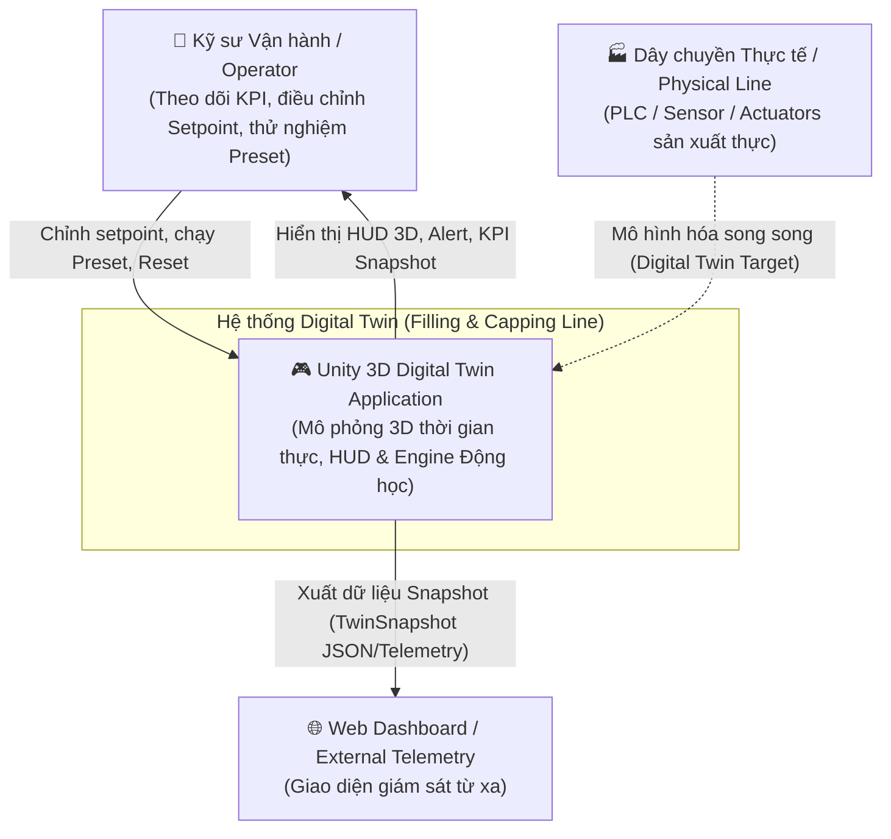
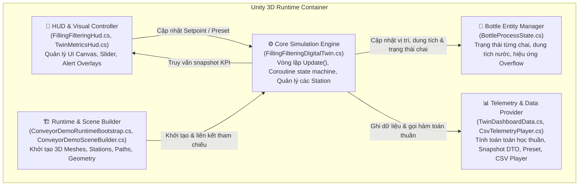
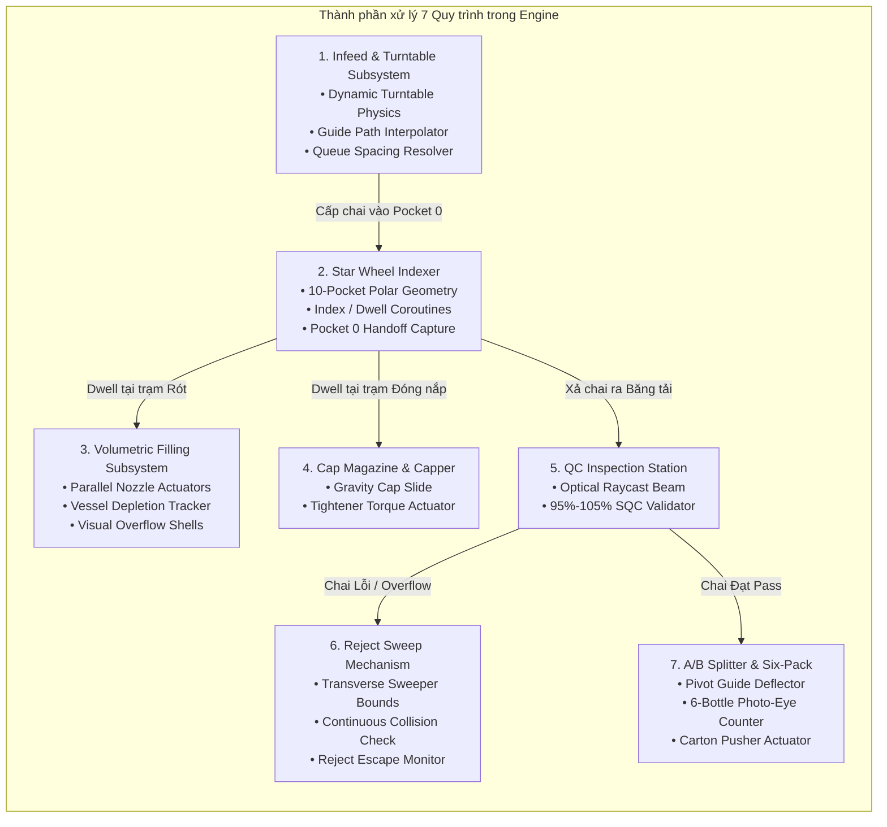
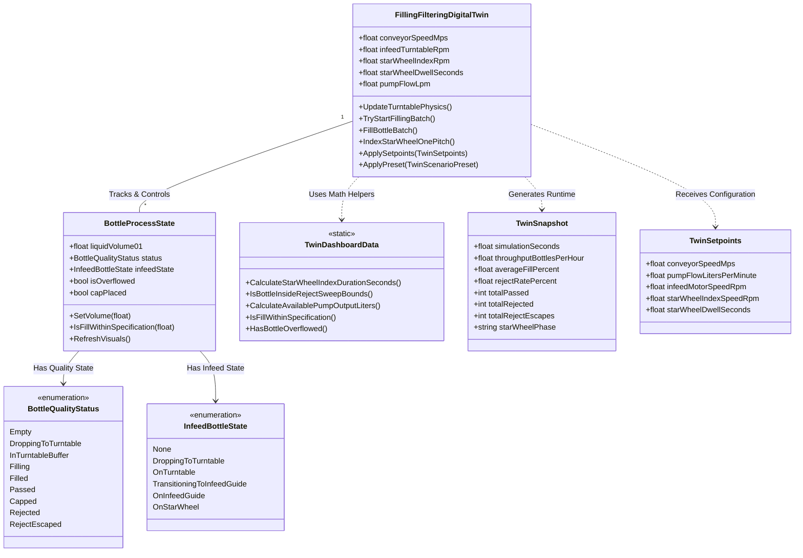

# Sơ đồ Thiết kế Hệ thống Digital Twin (C4 Model)

Tài liệu này trình bày kiến trúc phần mềm và sơ đồ thiết kế hệ thống Digital Twin chi tiết theo mô hình **C4 Model** (Context, Container, Component, Code/Class) cho dây chuyền chiết rót, đóng nắp và kiểm định chất lượng chai.

---

## 1. Level 1: System Context Diagram (Sơ đồ Ngữ cảnh Hệ thống)

Mô tả mối quan hệ giữa **Kỹ sư vận hành (Operator)**, hệ thống **Digital Twin Unity 3D**, **Web Dashboard / Telemetry Client**, và **Dây chuyền sản xuất thực tế (Physical Line)**.

### Chi tiết tương tác:
1. **Operator**: Tương tác trực tiếp qua GUI Unity HUD (kéo slider Conveyor speed, Pump flow, Infeed RPM, Star wheel RPM, Disc dwell).
2. **Unity App**: Chạy mô phỏng 3D thời gian thực, tích phân phương trình động học, thủy động học, va chạm và xuất trạng thái qua `TwinSnapshot`.
3. **Web Dashboard**: Nhận snapshot telemetry để hiển thị biểu đồ KPI qua thời gian (Throughput, Pass/Reject rate, Average fill).

---

## 2. Level 2: Container Diagram (Sơ đồ Container)

Phân rã ứng dụng Unity Digital Twin thành các container logic/phần mềm chính bên trong ứng dụng.

### Danh mục Container:
- **HUD & Visual Controller**: Nhận input người dùng, vẽ các bảng điều khiển KPI và cảnh báo sự cố.
- **Core Simulation Engine**: Trái tim hệ thống xử lý logic các quy trình (Infeed, Indexing, Filling, Capping, QC, Reject Sweep, Splitting).
- **Runtime & Scene Builder**: Tự động dựng mô hình scene 3D trong Unity (băng tải, mâm quay, đĩa Star Wheel, xi-lanh).
- **Bottle Entity Manager**: Gán vào từng chai 3D để quản lý thể tích $V_{\text{liquid}}$, màu sắc, trạng thái nắp và vỏ nước tràn.
- **Telemetry & Data Provider**: Chứa dữ liệu thuần không phụ thuộc Unity Engine (`TwinSnapshot`, `TwinSetpoints`, `TwinProcessMath`).

---

## 3. Level 3: Component Diagram (Sơ đồ Thành phần Chi tiết)

Phân tích cấu trúc các component logic bên trong **Core Simulation Engine** (`FillingFilteringDigitalTwin.cs`).

### Mô tả chức năng từng Component:
1. **Infeed & Turntable Subsystem**: Tính toán lực ly tâm, lực ma sát bề mặt, xử lý va chạm nẹp chắn và duy trì hàng chờ 1D trên đường dẫn infeed.
2. **Star Wheel Indexer**: Điều khiển xoay gián đoạn $108^\circ$ (3 pockets), khóa đồng bộ pha Dwell với hành trình vòi rót/đóng nắp.
3. **Volumetric Filling Subsystem**: Tính toán chia dòng nạp $Q_{\text{nozzle}} = Q_{\text{pump}} / N_{\text{active}}$, theo dõi mức bồn $V_{\text{vessel}}$, kích hoạt vỏ nước trào khi $V > 1.05\text{ L}$.
4. **Cap Magazine & Capper**: Mô phỏng nắp trượt tự do trong ống nắp và chu trình vặn siết nắp.
5. **QC Inspection Station**: Phát hiện chai đi qua cổng quang học $Z_{\text{QC}} = 0.85\text{ m}$ và đánh giá tiêu chuẩn $95\% \le \alpha \le 105\%$.
6. **Reject Sweep Mechanism**: Quét ngang thanh gạt lỗi tại $Z = 2.25\text{ m}$, kiểm tra va chạm AABB 3D và ghi nhận chai lỗi trốn gạt (Reject Escape).
7. **A/B Splitter & Six-Pack**: Điều hướng phân làn A/B khi đếm đủ 6 chai đạt chuẩn và kích hoạt xi-lanh đẩy chai vào thùng carton.

---

## 4. Level 4: Code & Class Diagram (Sơ đồ Mã nguồn / Lớp Dữ liệu)

Mô tả các lớp (Classes), cấu trúc (Structs), kiểu liệt kê (Enums) và hàm toán học lõi trong codebase C#.

---

## Tóm tắt Luồng Dữ liệu (Data Flow Overview)

1. **Khởi tạo (Initialization)**: `ConveyorDemoRuntimeBootstrap` khởi tạo scene $\rightarrow$ Gán tham chiếu cho `FillingFilteringDigitalTwin` $\rightarrow$ Đặt trạng thái ban đầu (`Nominal Preset`).
2. **Vòng lặp Thực thi (Update Loop & Coroutines)**:
   - `UpdateTurntablePhysics()`: Tính toán lực ly tâm & ma sát mâm quay ở từng frame.
   - `MoveBottles()`: Đưa chai chạy dọc băng tải và nẹp hướng.
   - `ApplyStarWheelPocketOperations()`: Chạy song song coroutine chiết rót, đóng nắp và index đĩa Star Wheel.
3. **Giám sát & Đánh giá Quality (Inspection & Telemetry)**:
   - `QC Sensor Beam`: Kiểm định dung tích rót.
   - `Reject Sweep Bar`: Loại chai hỏng.
   - `TwinSnapshot`: Tổng hợp chỉ số KPI đẩy lên HUD và Web Dashboard.
